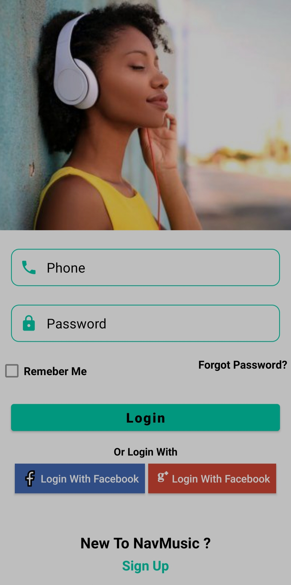
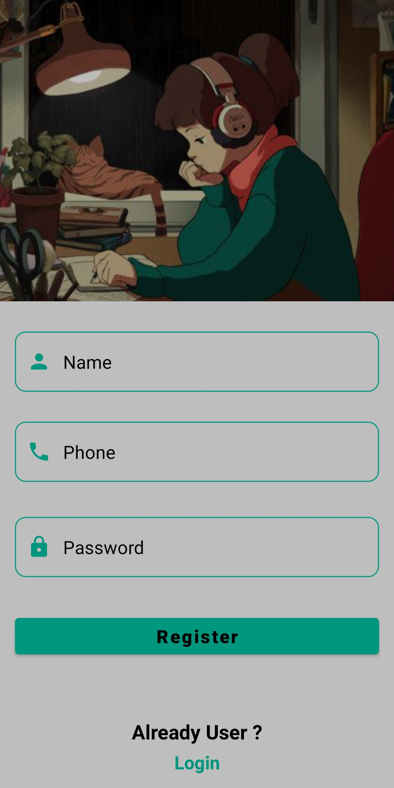
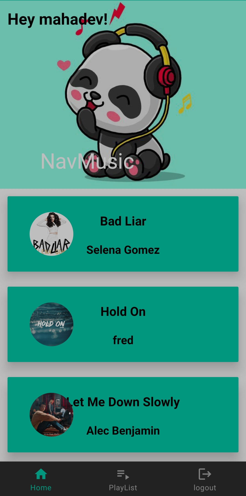
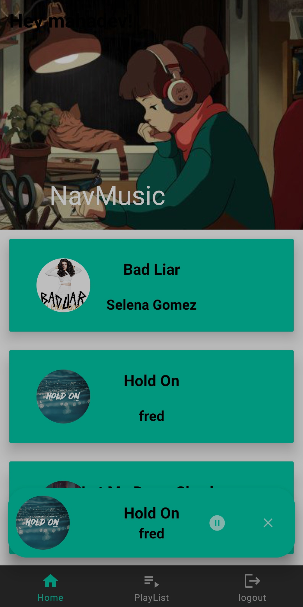
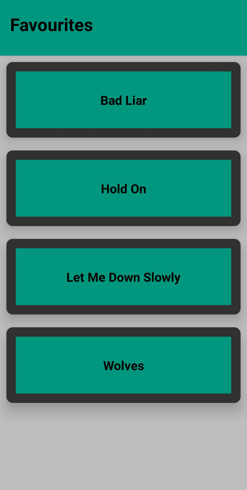

# NavMusic Android App

NavMusic is Spotify clone Android app with more attractive and easy-to-use UI

## Screenshots

## Features

- Light weight App
- Cool Animations
- Easy to use
- Like the song feature
- Add song to favourite playlist feature

## Tech Stack

**IDE** : Android Studio

**Backend** : Firebase

**Frontend** : Xml

**Core language** : Java

